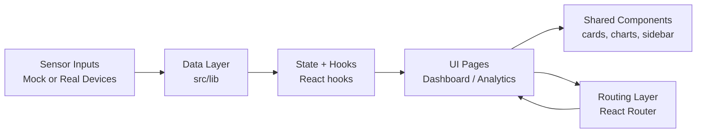
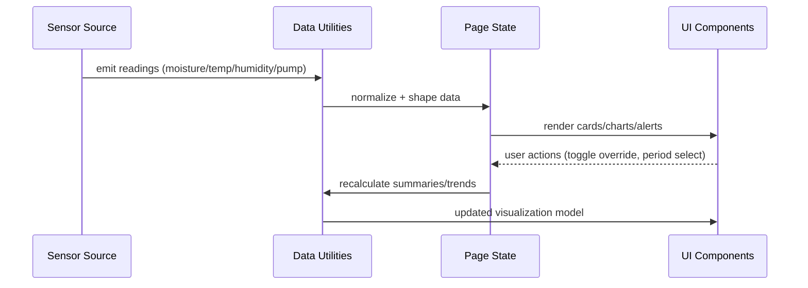
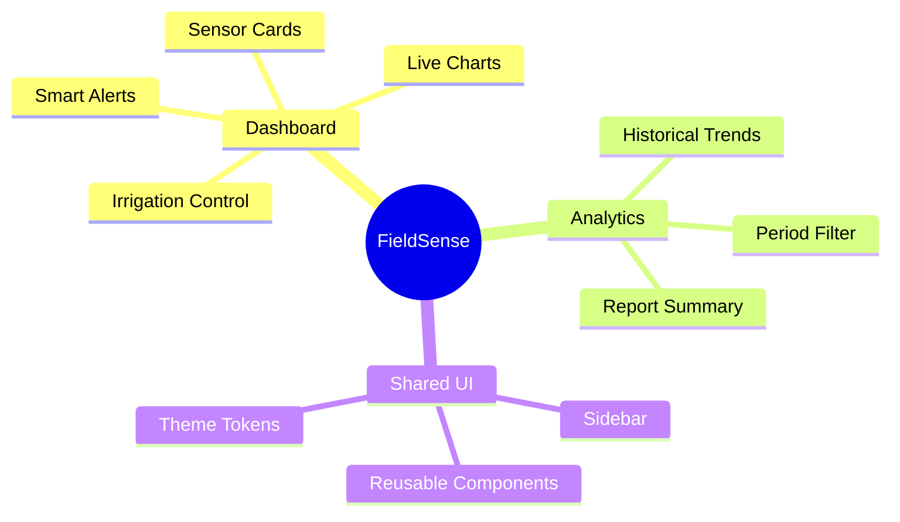
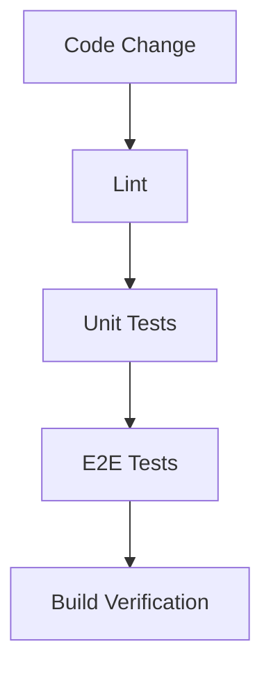

# FieldSense Dashboard

FieldSense is a smart irrigation and farm monitoring dashboard focused on real-time visibility, actionable alerts, and trend-based decision support for crop management.

---

## Table of Contents

- [Overview](#overview)
- [System Architecture](#system-architecture)
- [Data Flow](#data-flow)
- [Feature Map](#feature-map)
- [Tech Stack](#tech-stack)
- [Project Structure](#project-structure)
- [Quick Start](#quick-start)
- [Scripts](#scripts)
- [Environment and Configuration](#environment-and-configuration)
- [Testing Strategy](#testing-strategy)
- [Production Readiness Checklist](#production-readiness-checklist)
- [Roadmap](#roadmap)
- [Troubleshooting](#troubleshooting)
- [License](#license)

---

## Overview

FieldSense helps teams monitor critical farm metrics and quickly respond to irrigation needs.

### Core Capabilities

- Real-time sensor visualization:
  - Soil moisture
  - Temperature
  - Humidity
  - Pump status
- Dashboard controls:
  - Manual override support
  - Auto-mode status
  - Smart alert feed
- Analytics:
  - Day/week/month time windows
  - Trend charts
  - Auto-generated summary report text

---

## System Architecture



### Architecture Notes

- `src/lib` currently provides mock generators and helper logic.
- UI pages are route-driven and consume prepared data/state.
- Shared UI components keep the feature pages focused and maintainable.

---

## Data Flow



---

## Feature Map



---

## Tech Stack

- **Framework:** React 18 + TypeScript
- **Build Tool:** Vite
- **Styling:** Tailwind CSS
- **UI Pattern:** shadcn-style component system
- **Charts:** Recharts
- **Routing:** React Router
- **Testing:** Vitest, Testing Library, Playwright

---

## Project Structure

```text
IoT Project/
  README.md
  fieldsense-dashboard/
    public/                  # Static assets
    src/
      components/            # Shared and UI components
      hooks/                 # Reusable hooks
      lib/                   # Data generators and helpers
      pages/                 # Route pages (Dashboard, Analytics, etc.)
      App.tsx                # App shell and route mounting
      main.tsx               # Entry point
    index.html               # App metadata and HTML root
    vite.config.ts           # Vite setup and aliases
    playwright.config.ts     # Playwright E2E config
    package.json
```

---

## Quick Start

### Prerequisites

- Node.js 18+ (Node.js 20 LTS recommended)
- npm 9+

### Install

```bash
cd fieldsense-dashboard
npm install
```

### Run Development Server

```bash
npm run dev
```

App URL: `http://localhost:8080`

### Build and Preview

```bash
npm run build
npm run preview
```

---

## Scripts

- `npm run dev` - start local development server
- `npm run build` - create production build
- `npm run build:dev` - development-mode build
- `npm run preview` - serve built output locally
- `npm run lint` - run ESLint checks
- `npm run test` - run Vitest once
- `npm run test:watch` - run Vitest in watch mode

---

## Environment and Configuration

### Vite Config (`vite.config.ts`)

- dev server host and port
- path alias (`@` -> `src`)
- React SWC plugin

### HTML Metadata (`index.html`)

- page title
- SEO description
- OpenGraph and Twitter metadata

### Playwright (`playwright.config.ts`)

- E2E test directory
- base URL (`http://localhost:8080`)
- trace capture on first retry

---

## Testing Strategy



### Suggested CI Pipeline

1. `npm ci`
2. `npm run lint`
3. `npm run test`
4. `npm run build`
5. (Optional) `npx playwright test`

---

## Production Readiness Checklist

- [ ] Connect real telemetry source (API, MQTT, or WebSocket)
- [ ] Add authentication and roles (Admin/Operator/Viewer)
- [ ] Persist historical data in a database
- [ ] Implement true report export (PDF/CSV)
- [ ] Add alert acknowledgment and escalation rules
- [ ] Add CI/CD workflow and release versioning
- [ ] Add observability (logs, metrics, uptime)

---

## Roadmap

### Near Term

- Integrate live field data APIs
- Add farm zones and sensor grouping
- Improve anomaly detection rules

### Mid Term

- Forecast-based irrigation recommendations
- Device health diagnostics dashboard
- Multi-farm tenancy support

### Long Term

- Predictive irrigation automation
- Yield optimization modeling
- Edge sync for low-connectivity areas

---

## Troubleshooting

- **Port 8080 in use**
  - Change the port in `vite.config.ts`, or stop the process currently using it.

- **Fresh install issues**
  - Windows PowerShell:
    ```powershell
    Remove-Item -Recurse -Force node_modules
    Remove-Item -Force package-lock.json
    npm install
    ```
  - macOS/Linux:
    ```bash
    rm -rf node_modules package-lock.json
    npm install
    ```

- **Lint/test/build failures**
  - Run commands one by one and fix first failure in order:
    1. `npm run lint`
    2. `npm run test`
    3. `npm run build`

---

## License

No license file is currently included. Add a `LICENSE` file before public distribution or commercial deployment.
